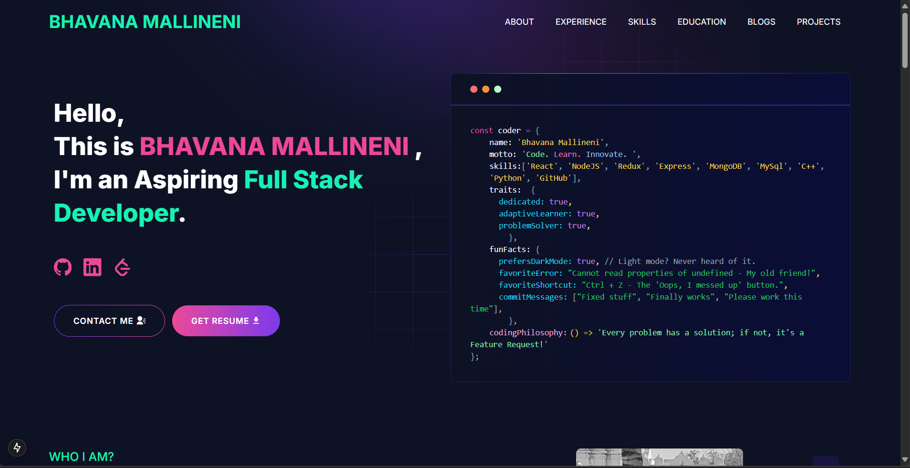

    

---

# **Bhavana Mallineni – Portfolio 🚀**

This is my personal **developer portfolio**, built with **Next.js, React, Node.js, and Tailwind CSS**.  
It showcases my **projects, skills, experience, and contact details** in a clean, interactive format.

### **🔗 Live Preview:** [www.bhavana_portfolio.com](https://www.bhavana_portfolio.com)

---

## **📌 About This Portfolio**
This portfolio is **built using a template from** [Developer Portfolio GitHub Repo](https://github.com/said7388/developer-portfolio),  
which I have customized to match my profile and professional experience.

---

## **🛠 Tech Stack**
- **Frontend:** React.js, Next.js, Tailwind CSS
- **Backend:** Node.js, Express.js, Nodemailer (for email)
- **Database:** MongoDB (if applicable)
- **Other Tools:** GitHub Actions, Telegram API, Email Services

---

## **📸 Demo Screenshot**

---

## **📦 Packages Used**
| Package | Purpose |
|---------|---------|
| **next** | Server-side rendering & routing |
| **react** | Frontend UI components |
| **tailwindcss** | Styling framework |
| **nodemailer** | Sending emails |
| **axios** | API requests |
| **react-icons** | Icons |
| **react-fast-marquee** | Smooth skill scrolling |

---

## **📜 License**
This project is **based on an open-source template** from [Developer Portfolio GitHub Repo](https://github.com/said7388/developer-portfolio),  
which has been **modified** to better suit my portfolio.

---

### **📬 Let's Connect!**
🔗 **Portfolio:** [https://portfolio-git-main-bhavana-mallineni.vercel.app/](https://portfolio-git-main-bhavana-mallineni.vercel.app/)  
🔗 **GitHub:** [Bhavana-Mallineni](https://github.com/Bhavana-Mallineni)  
🔗 **LinkedIn:** [Bhavana Mallineni](https://www.linkedin.com/in/bhavana-mallineni-640184210/)  
